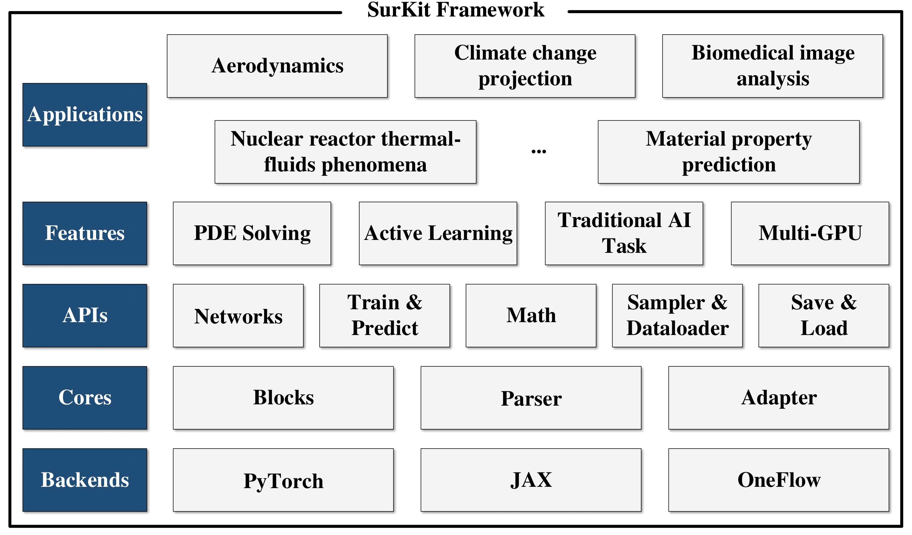
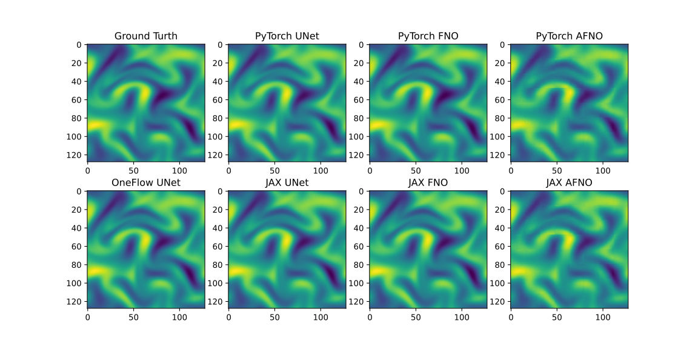

<div align="center">

SurKit
======
<h4>a toolkit for deep neural network surrogate model development</h4>

[](https://pypi.org/project/surkit/)
[](https://www.gnu.org/licenses/lgpl-3.0)
[](https://surkit.readthedocs.io/en/latest/?badge=latest)
</div>

**SurKit** is a framework for surrogate models that enables researchers to efficiently construct, train, evaluate, deploy, and execute different kinds of surrogate models across multiple backends, providing an intuitive method to integrate advanced deep learning models into workflows.

<!--  -->



## 🌟 Core features

- **Multi-Model Integration**: Integrates a variety of data-driven or physics-constrained neural network surrogate models for solving PDEs (e.g., PINN, FNO, UNet, AFNO, etc.).
- **Active Learning**: Includes multiple sampling strategies such as Latin Hypercube Sampling (LHS), Sobol sequences, and adaptive sampling.
- **Uncertainty Quantification**: Provides uncertainty quantification through neural network ensembles and Bayesian neural networks.
- **Standardized Interface**: Features a unified **API** design that supports rapid training and allows for customization through the assembly or replacement of **cores**-level modules.
- **Multi-GPU Training**: Supports distributed data parallelism for efficient training.
- **Multiple Backends**: Offers a variety of backends, each with its own unique features and advantages. 

## 🚀 Quick start

### Installation

#### System requirements

SurKit requires some prerequisites including NumPy, Matplotlib, and at least one of the following frameworks:

- PyTorch: PyTorch>=1.9.0

- Oneflow: Oneflow>=0.9.0

- JAX: JAX>=0.3.25, Flax>=0.6.4, Optax>=0.1.4

#### Install with pip package

To Install the stable version of Surkit with pip:

```bash
pip3 install surkit
```
#### Install from source
To install the latest development version of Surkit from the source code, you can clone the repository using the following command:
```bash
git clone https://github.com/CodexDive/SurKit.git
```

## 📈 Example result
The following figure illustrates the performance of Surkit on a CFD-solving task using different neural network architectures and backends. The figure shows comparison between the ground truth solution and the predictions from various models:


## 📖 Documentation

Please refer to https://surkit.readthedocs.io/en/latest/index.html. 